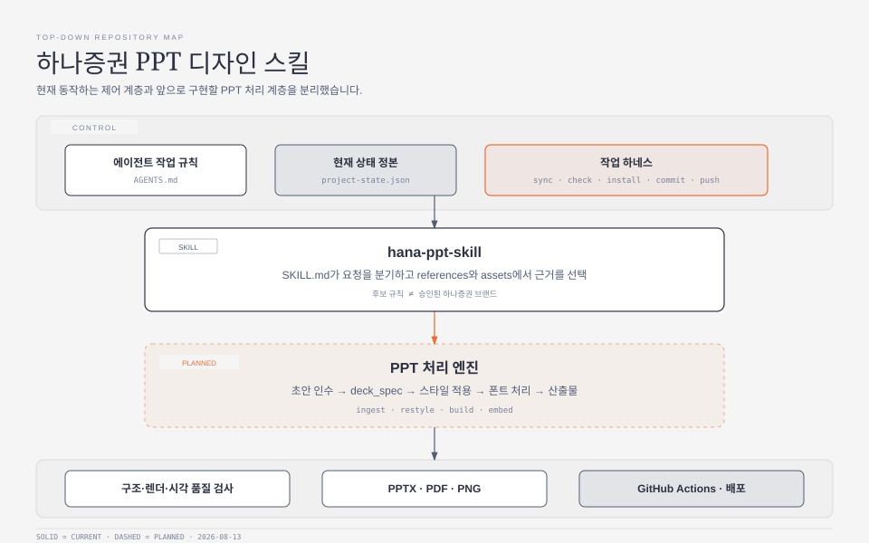

# 아키텍처

## 한눈에 보기

이 저장소는 위에서 아래로 `작업 제어 → 스킬 판단 → PPT 처리 → 검증·배포` 네 계층으로 구성합니다.



## 1. 작업 제어 계층

저장소 변경이 문서와 어긋나지 않도록 작업 전후를 통제합니다.

- `AGENTS.md`: 모든 에이전트가 따라야 하는 절차
- `project-state.json`: 현재 완료·후보·미착수 상태의 단일 정본
- `tools/task_harness.py`: 상태 문서 생성, 검증, 설치, 커밋과 푸시
- `docs/STATUS.md`: 정본에서 생성되는 사람용 현황판

`STATUS.md`는 직접 편집하지 않습니다. 현재 사실을 바꾸려면 `project-state.json`을 수정하고 하네스로 다시 생성합니다.

## 2. 스킬 계층

Codex가 어떤 자료를 읽고 어떤 기능을 실행할 수 있는지 결정합니다.

- `hana-ppt-skill/SKILL.md`: 요청 분기와 실행 안전장치
- `hana-ppt-skill/agents/openai.yaml`: UI 표시와 기본 호출 문구
- `hana-ppt-skill/references/`: 디자인 토큰, 레이아웃, 문체와 분석 근거
- `hana-ppt-skill/assets/`: 폰트, CI, 원본 레퍼런스, 기준 이미지와 후보 JSON

저장소의 `hana-ppt-skill/`이 정본이고, 로컬의 `.codex/skills/hana-ppt-skill/`은 설치본입니다. 설치본을 직접 수정하지 않고 정본을 갱신한 뒤 `task_harness.py install`로 동기화합니다.

## 3. PPT 처리 계층

`ingest_deck.py`와 `deck_spec` JSON Schema까지 MVP로 구현됐습니다. 사용자 승인된 운영 `brand.json`은 마련됐지만 스타일 적용·생성·폰트 처리는 예정 상태입니다.

```text
초안 PPTX 또는 구조화된 초안
  → ingest_deck.py
  → deck_spec.json
  → restyle_deck.py / build_deck.py
  → 폰트 임베딩 또는 정적 대체
  → render_slides.py
  → PPTX · PDF · PNG
```

### 엔진과 규칙의 계층 분리

`restyle_deck.py`/`build_deck.py`/`render_slides.py`/`quality_check.py`는 PPTX 조작·렌더링이라는 범용 문제를 다룹니다. 이 저장소가 실제로 더하는 가치는 하나증권 브랜드·문체 규칙(승인된 `brand.json`, `voice.json`)뿐입니다. 그래서 이 계층은 두 겹으로 설계합니다.

- **엔진 겹**: PPTX 인수, 슬라이드 복제·정리, 렌더링, 구조·파일 검증처럼 문서군에 무관한 범용 처리
- **규칙 겹**: 승인된 브랜드·문체·레이아웃 근거만 엔진에 주입하는 하나증권 고유 로직

Anthropic이 공개한 pptx 스킬의 흐름(인수 → 편집 → 렌더 → 3단계 품질 검사: 콘텐츠 QA → 파일/구조 QA → 시각 QA)은 이 두 겹 분리의 유효성을 보여주는 참고 사례로 삼되, **코드는 복제하지 않습니다**. 해당 스킬의 `LICENSE.txt`는 서비스 밖으로의 추출·복제·파생물 제작·재배포를 금지하므로, 이 저장소의 엔진 겹 스크립트는 같은 아이디어를 독자적으로 새로 구현합니다.

`restyle_deck.py`의 1차 구현은 이 분리를 그대로 따릅니다. `apply_theme_colors`/`apply_theme_fonts`는 어떤 문서군에도 통하는 순수 엔진 함수(테마 XML의 색상·폰트 슬롯만 치환)이고, `brand.json`의 색상 role을 OOXML 테마 슬롯(`dk1`, `accent1` 등)에 연결하는 `COLOR_SLOT_ROLE` 매핑만 하나증권 고유 규칙입니다. 슬라이드 XML은 아예 읽지 않으므로 `restyle-only` 모드의 원문 잠금이 코드 구조로 보장됩니다.

`hana-refine`은 텍스트를 실제로 다시 써야 해서 같은 방식(코드가 결과를 결정)으로는 안전을 보장할 수 없습니다. 대신 **생성(에이전트)과 검증(엔진)을 분리**합니다. `text_units.py`는 슬라이드의 `<a:t>` 런을 문서 순서 그대로 추출/치환하는 범용 엔진 함수만 제공하고, 실제 문장을 판단해 다시 쓰는 일은 그 결과를 소비하는 에이전트(Claude/Codex 세션)가 합니다. `verify_evidence_preserved.py`는 에이전트가 작성한 수정안을 원문과 대조해 숫자·비교 기준(`전년동기 대비` 등)이 보존됐는지 기계적으로 확인하고, 하나라도 어긋나면 `restyle_deck.py`가 어떤 슬라이드도 쓰지 않습니다. 절차는 [hana-refine-workflow.md](../hana-ppt-skill/references/hana-refine-workflow.md)에 있습니다.

두 실행 모드를 제공합니다.

- `restyle-only`: 원문, 수치와 데이터는 잠그고 디자인만 개선
- `hana-refine`: 제공된 근거 안에서 제목, 말투, 구조와 디자인을 개선

범용 조사와 최초 초안 작성은 이 계층의 책임이 아닙니다.

## 4. 검증·배포 계층

현재 자산·상태 검사와 LibreOffice 기반 렌더링은 동작하고 PPT 구조·시각 품질 검사는 구현 예정입니다.

- 현재 동작: JSON 파싱, 문서 UTF-8·제어 문자, 자산 경로·크기·SHA-256, 기준 이미지, 제외 레퍼런스, 상태 문서 동기화, `render_slides.py`의 PPTX → PDF → 슬라이드별 이미지 변환과 render manifest 생성
- 구현 예정: PPT 구조 검사(`quality_check.py`), 잘림·겹침·정렬 검사, 비전 평가(`visual_check.py`), 폰트 임베딩 검증
- 계획된 3단계 품질 검사: ① 콘텐츠 QA(텍스트 누락·플레이스홀더) ② 구조 QA(스키마·관계·자산 정합성) ③ 시각 QA(렌더 이미지를 별도 검토 관점으로 확인). 렌더러나 도구가 없으면 결과를 `partial`로 표시하고 최종 성공으로 취급하지 않습니다.
- 원격 검사: `.github/workflows/repository-harness.yml`

## 정본 우선순위

| 데이터 | 정본 | 파생 결과 |
|---|---|---|
| 진행 상태 | `project-state.json` | `docs/STATUS.md` |
| 승인 브랜드 | `assets/brand.json` | 문서·PPT 산출물 |
| 승인 운영 문체 | `assets/voice.json` | 제목·불릿 문체 진단 및 향후 변환 |
| 검수 전 브랜드 | `assets/brand.candidate.json` | `references/design-tokens.md` |
| 레퍼런스 포함 여부 | `assets/reference-decks/sources.json` | 분석·기준 이미지 목록 |
| 스킬 실행 절차 | `hana-ppt-skill/SKILL.md` | 로컬 Codex 설치본 |
| PPT 내용 | 향후 `deck_spec.json` | PPTX·PDF·PNG |

## 설계 원칙

- 후보와 승인을 파일 수준에서 분리합니다.
- 상세 규칙은 스킬 references에만 두고 프로젝트 문서에 복제하지 않습니다.
- 배포 산출물보다 구조화된 정본을 먼저 수정합니다.
- 자동 게시 전에 기존 사용자 변경이 섞이지 않았는지 확인합니다.
- 렌더러가 없는 검사는 최종 성공이 아니라 `partial`로 처리합니다.
- 외부 스킬(예: Anthropic 공식 pptx 스킬)의 코드는 복제·파생하지 않습니다. 라이선스로 재배포가 금지된 자료는 아이디어만 참고해 이 저장소 안에서 독자 구현합니다.
